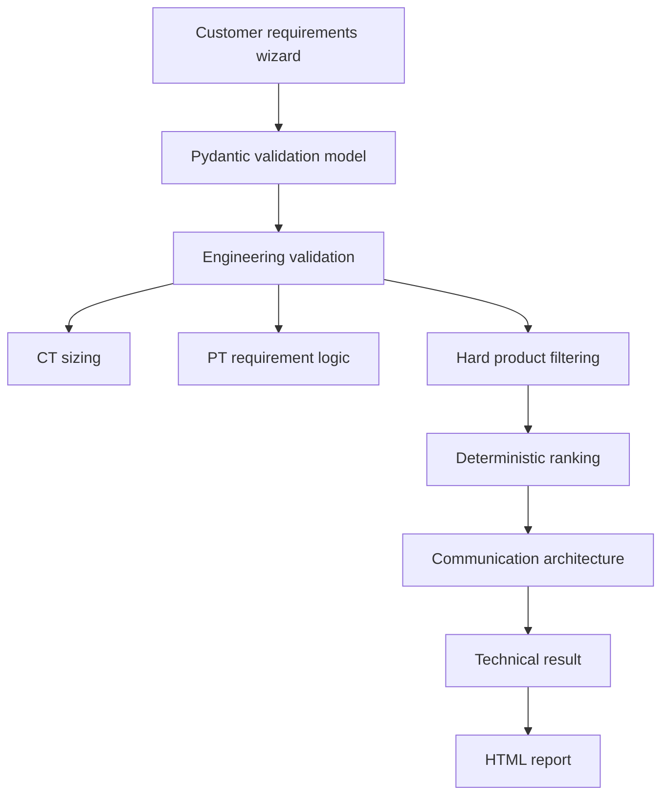

# MeterSpec Architecture

MeterSpec keeps engineering decisions separate from the web interface.

The catalog is stored in `data/catalog.yaml` so product limits and capabilities are not scattered through source code.
